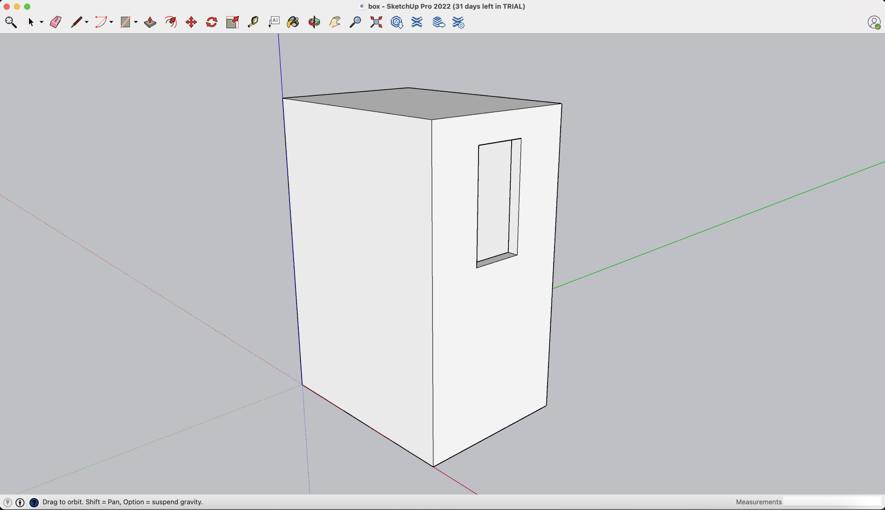
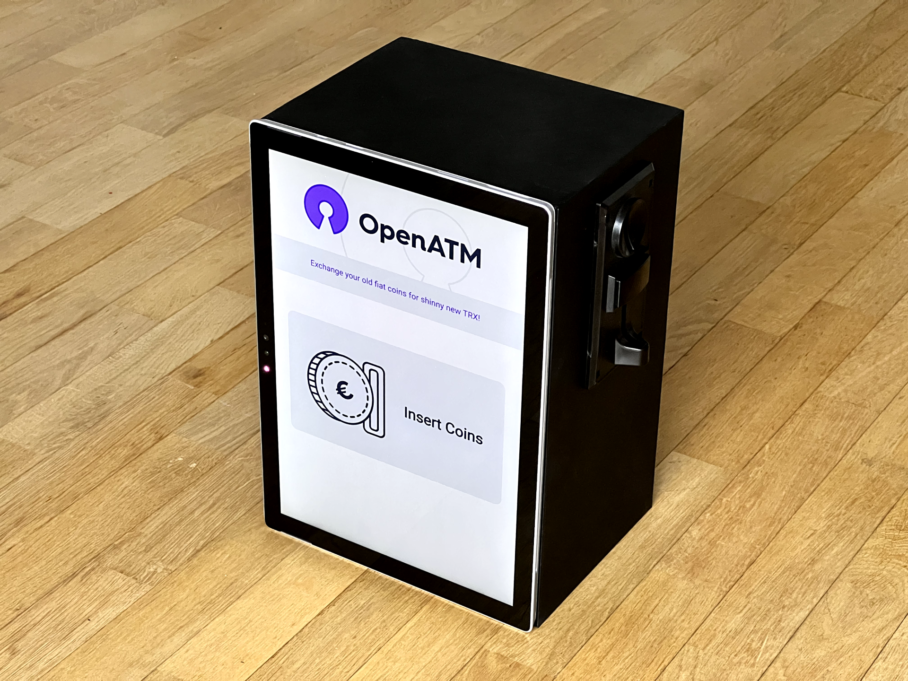

# Open ATM

Open ATM is a free and open source Do-It-Yourself ATM on Tron allowing anyone to exchange their old fiat coins for shiny new TRX. The goal is for anyone to be able to build one just like that at home.

# What you need

- A coin acceptor with a USB wafer, usually [available for $20 on Amazon](https://www.amazon.com/s?k=coin+acceptor)

- A windows or linux tactile tablet with a built-in camera (for scanning QR codes)

- A box to attach the tablet and coin acceptor to. It will also store the physical coins until you fetch them. Any box big enough will do but if you want it to look a little more professional like mine, you can 3D print a custom box. You will find [in the repository](./frontend/public/box.stl) the STL file of the box I created on SketchUp to perfectly fit my tablet and Coin Acceptor. I then used [Shapeways](https://www.shapeways.com/), a 3D printing service, to print it for me.

Here is the model:

And the printed result:

Here is all you need:

- As a user of the ATM, you will need a tron wallet on your smartphone such as TronLink or Trust Wallet thats displays your public address as a QR code. 

Here is the final ATM:

Obviously this ATM isn't very secure and could easily be broken into so only place it at your home or at work to impress your friends and collegues. Maybe one day I'll do a professional version for banks and the general public. 

Finally the code is free and open source so don't hesitate to contribute to it and let me know what could be improved. 

Thank you for watching.