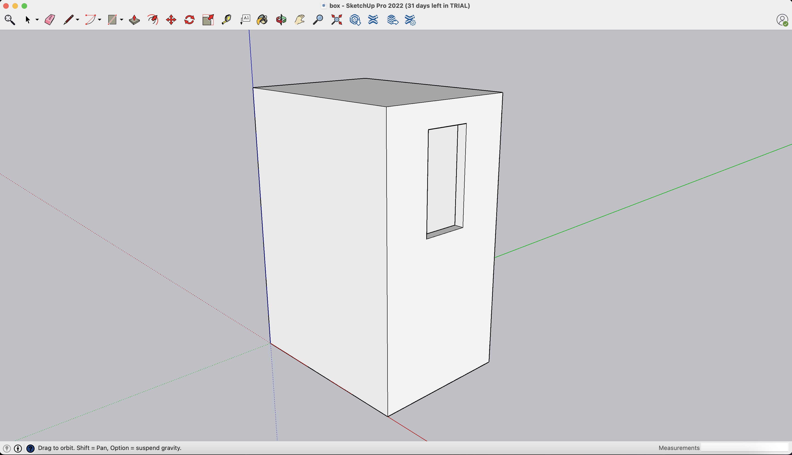

# Open ATM

Open ATM is a free and open source code repository that will allow you to build your own Tron ATM. Once built, it will allow you to insert your fiat coins into the ATM, compute the exchange rate then trigger a transaction of TRX tokens to your wallet. 

# What you need

- A coin acceptor with a USB wafer, usually [available for $20 on Amazon](https://www.amazon.com/s?k=coin+acceptor)

- A windows or linux tactile tablet with a built-in camera (for scanning QR codes representing public addresses)

- A box to attach the tablet and coin acceptor to. It will also store the physical coins until an you fetches them. Any box big enough will do but if you want it to look a little more professional, you can 3D print our custom box. You will find [here](./public/box.stl) the STL file of a box we created on SketchUp to perfectly fit our tablet and Coin Acceptor. I then used [Shapeways](https://www.shapeways.com/) to 3D print it for me.

- As a user of the ATM, you will need a tron wallet on your smartphone such as TronLink or Trust Wallet thats displays your public address as a QR code. 

